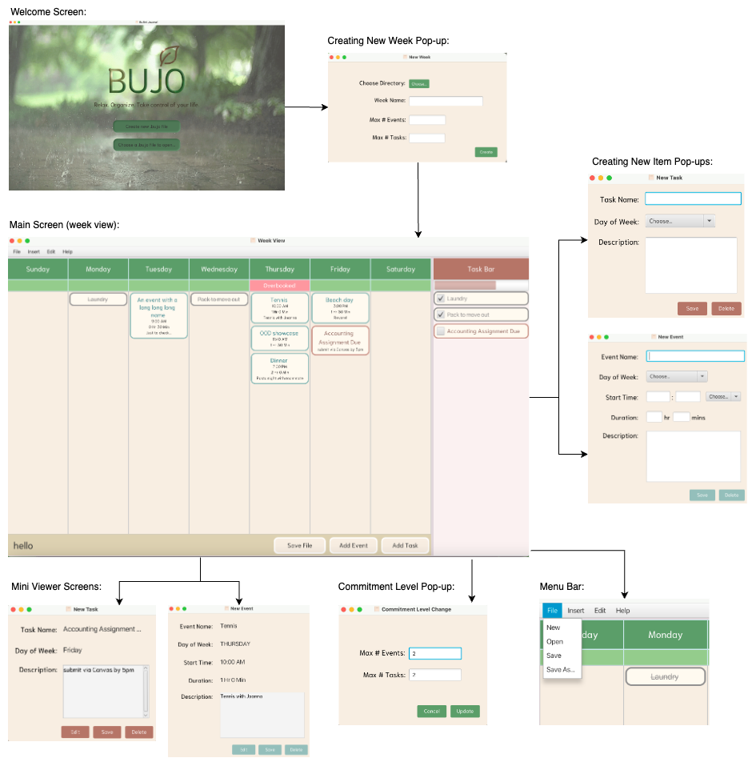

# 3500 PA05 "Winston Ate My Bullet Journal" 
Version 1.0.0

This is a simple Bullet Journal application. It allows viewing and editing of a weekly agenda,
along with the ability to create events and tasks. It also has a taskbar that allows for quick
creation of tasks and events. You can also save the week in a .bujo file, which can be read later.
The application will also warn you if you have overcommitment, and allows the setting of maximum event and
task commitments for any given day. This program also implements keyboard shortcuts, hyperlink support,
a progress bar, and the ability to open tasks or events in a separate viewer. The week file can also be 
password-protected, and the password is hashed, so it can't be directly read from the file.

## Keyboard Shortcuts:
- `ctrl + s` to save
- `ctrl + n` to create a new week
- `ctrl + e` to create a new event
- `ctrl + t` to create a new task
- `ctrl + o` to open a ".bujo" file
- `ctrl + d` to delete an event or task
- `ctrl + q` to save and quit
- `ctrl + m` to toggle background music on\off

## Jar File
[Jar File](JournalApp.jar)
**Note:** At time of writing, this jar file runs only when executed from the command line, as `java -jar JournalApp.jar`
This is consistent with the `Server.jar` from PA04 on the machine tested. 

## SOLID Principles

### Single Responsibility Principle:

This program implements the single-responsibility principle across the design. We segregated
the program into a model, view, and controller, with separate classes to handle individual responsibilities.
For instance, each view has its own controller, which have a high-level controller themselves. In this way,
the program is broken down into individual components that each have a single responsibility.

### Open/Closed Principle:

We have designed our program using a combination of inheritance and composition. This is such that
extending the program is easy and straightforward. For instance, if a new type of calendar item was required,
it could simply extend the Item class such as Event and Task both do. 

### Liskov Substitution Principle:

This program implements the Liskov Substitution Principle by using inheritance correctly.
It is typical in this program to use the Item class as a reference to either an Event or a Task, which
is a fundamental component of this principle. This allows for the program to be extended easily, as
mentioned in the Open/Closed Principle section.

### Interface Segregation Principle:

This program implements the Interface Segregation Principle by using interfaces to define
key functionality. For instance, the Item interface defines the methods that are required for
an item to be displayed in the calendar. This allows for the program to be extended easily, as
mentioned in the Open/Closed Principle section.

### Dependency Inversion Principle:

This program implements the Dependency Inversion Principle, by abstracting the high-level functionality.
For instance, the top level controller primarily delegates responsibility to the lower-level controllers.

# GUI:

[PA Write Up](https://markefontenot.notion.site/PA-05-8263d28a81a7473d8372c6579abd6481)

### Media Attributions:
- [Book Logo](https://icons8.com/icon/l6iocFkbmCrh/book)
- [Welcome Page Background](https://imgur.com/gallery/bVovN)
- [Background music](https://pixabay.com/music/solo-piano-flaing-piano-main-8783/)
